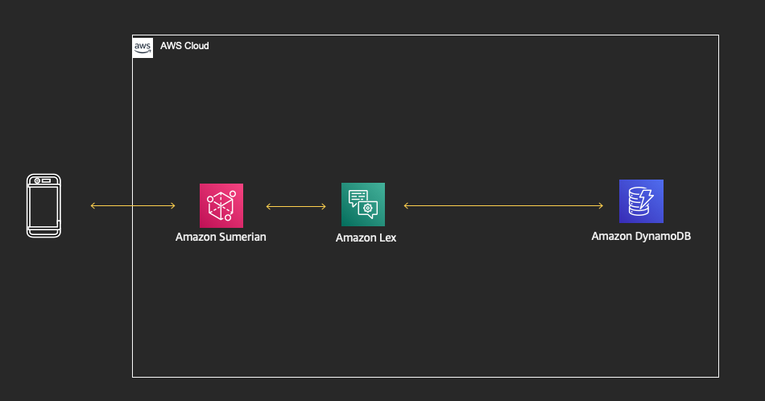

# ARsteering
Content for AUT401 - Building AR and AI automotive owner applications with AWS

## Abstract
Augmented reality (AR), AI, and IoT services can be used to jointly create both visual and aural owner applications, such as an interactive owner’s manual. This session is dedicated to selecting and applying the appropriate AWS tools and services to build interactive owner applications for increasing after-market sales, personalization/localization of services, next-generation design, advertising, and media distribution. Developers and UX designers learn how to easily create applications that reinvent the way we interact with our vehicles in both the physical and digital worlds. Please bring your laptop.

## Architecture Diagram

## Step 1 (deploying AWS CloudFormation template)
Clicking a button below (and following a wizard), deploy `AWS CloudFormation` stack into your account and `us-east-1` region. 
This stack deploys:
* `Amazon Cognito` identity pool (and associated `AWS IAM` role), that allows `Amazon Sumerian` scene to talk to other services
* `Amazon DynamoDB` table, that will contain manual functions, their steps and descriptions, we want to support. (one initial function for `geatshift`/shifter will be already stored in this table)
* `AWS Lambda` function (and associated `AWS IAM` role) that helps `Amazon Lex` bot access `Amazon DynamoDB` table

You can name the stack `arsteering` and you will need to acknowledge that `AWS IAM` resources will be created within this stack deployment. 
The stack will take approximately 5 minutes to run and provision above resources.
## Step 2 (importing AWS Lex bot)
Download `AWS Lex` [package in .zip format into your computer from here](https://www.google.com). Navigate to `AWS Lex` service in `us-east-1` region, import the zip file that you've downloaded. You will now see `ARsteering` bot in your console. At the bottom of a page of particular intent, link the intent to `AWS Lambda` function called `ARsteering`, that was provisioned by `AWS CloudFormation` in Step 1. Build the bot, test it and publish them under the alias `latest`.

## Step 3 (importing Amazon Sumerian scene)
Download `Amazon Sumerian` [scene export in .zip format into your computer from here](https://www.google.com). Navigate to `Amazon Sumerian` service in `us-east-1` region and create a new empty scene and call it `ARsteering`. After the scene loads, delete `Default dynamic lights` entity collection and rename the `Default Camera` entity to the `Old Camera` (this is to avoid having multiple of these entities/collections after we import the .zip). We then drag and drop the downloaded .zip onto the canvas of our `Amazon Sumerian` scene. After the import finishes, multiple entities appear in our scene. We click on `Default Camera` entity and set it as a Main Camera in the component panel.
### Explore the scene and entity collections
Get use to Sumerian interface, understand:
* panel of entities (where our steering wheel model, HTML UI, cameras and light sources live)
* panel of assets (where are scripts and state machines live)
* canvas (where you see a preview of the scene)
* panel of components (where every entity has associated properties - like color, size and position, state machines, scripts, speech files and/or dialogs)
### Setting up Cognito
Before we play the scene, we need to input the `Amazon Cognito` identity pool ID into the AWS Configuration of the main  inside `Amazon Sumerian`. This ID was generated in the Step 1 and can be found in the `Outputs` tab under `ARsteeringCognitoOutput` of `AWS CloudFormation` stack we launched in Step 1. The `AWS Cognito` Identity Pool ID will look similar to `us-east-1:XXXXXXXX-WWWW-QQQQ-ZZZZ-YYYYYYYYYYYY`
### Setting up Lex
Before we play the scene, we need to input the `AWS Lex` bot details into a Dialogue component attached to `SteeringWheel` entity. Click on `SteeringWheel` entity, in the component panel, you will see Dialogue tab, it should be populated like this:
* Name: `ARsteering`
* Alias: `latest`
### Play the scene
We can play the scene now. What we should we able to see, is that, besides the steering wheel, we have a button for Shifting Gears (orange) as well as a button for Microphone/Voice input (blue). 

By:
* clicking the orange button, we can directly trigger the manual function for shifting gears, this information comes from `Amazon DynamoDB` table that was created in Step 1.
* clicking the blue button, saying: `How can I use gear shift?` and clicking the button again, will invoke the same function, but, by using voice.

In next sections, we will add more functions beyond just `Shifting Gears`.
### Changing accent colors and highlight colors
Furthermore, we can change a scene and have little fun. There are many ways how to modify entities, but two very simple ones are:
* Changing the `accent color` (orange by default) on the steering wheel. This can be done by drilling into `SteeringWheel` entity collection > `Wheel` entity collection > `WheelSides` entity. After clicking `WheelSides` entity, we can click on `Material` component on the right and under `COLOR (DIFFUSE)`, we can set a different color using a colorpicker. (we should see this change immediatelly)
* Changing the `highlight color` (red by default) of the guide/manual. This can be done by clicking on `SteeringWheel` entity collection, then we click on `State Machine` component and under `PerformCommand` state machine editing option, we locate `Perform Commands` Script. This script has a `Highlight Color` parameter, that is again a colorpicker. (to realize this change, we need to play the scene and invoke a command via button or voice)
## Step 4 (adding another commands)
As mentioned in Step 3, we can be adding other commands too. There is two simple ideas (and a cheatsheet section at the end) that can be implemented:
* Alexa button functionality, which can be invoked from the small button on the bottom of the steering wheel.
* Start/Stop button functionality, which enables keyless starting on/off the engine. The button is located on the center right side of the steering wheel.
To create a new command, head to `Amazon DynamoDB` console in `us-east-1` region and locate `ARsteering` table. In `Items` tab of this table, you will see how gearshift function is implemented. You will create two new items in this table:
* name: "`Invoking alexa`" operation: "`alexa`"
* name: "`Starting/Stopping your vehicle`" operation: "`startstop`"
Each of these needs to manipulate right (set of) entity in the SteeringWheel entity collection, so look at what are entity names for Alexa button, or Start/Stop button.
## Step 5 (deployment options)
When we are done with edits, and functionality, we can publish our scene with one click. Navigate to `Publish` menu in right top corner of the editor and click `Create public link`. This link will then be shareable with your anyone with a web-browser, as well as can be embedded into mobile applications supporting [ARkit](https://docs.sumerian.amazonaws.com/tutorials/create/intermediate/augmented-reality-using-sumerian-arkit/) and/or [ARcore](https://docs.sumerian.amazonaws.com/tutorials/create/intermediate/augmented-reality-using-sumerian-arcore/).
# Cheatsheet
### Alexa command
`
{
  "name": "Invoking Alexa",
  "operation": "alexa",
  "steps": [
    {
      "actions": [
        "AlexaButton"
      ],
      "end": 5,
      "start": 0
    }
  ],
  "text": "You can invoke Alexa by pressing a button and asking a question, additionally you can just invoke always-on listening engine by saying Alexa"
}
`
### Start/Stop command
`
{
  "name": "Starting/Stopping your vehicle",
  "operation": "startstop",
  "steps": 
  [
    {
      "actions": [
        "StartStopButton"
      ],
      "end": 5,
      "start": 0
    },
    {
      "actions": [
        "StartStopButton"
      ],
      "end": 9,
      "start": 6.5
    }
  ],
  "text": "You can start the vehicle by pressing and holding the Start ENGINE Stop button, when the ignition is off, the vehicle will start up and when it's running, it will cause engine turning off."
}
`